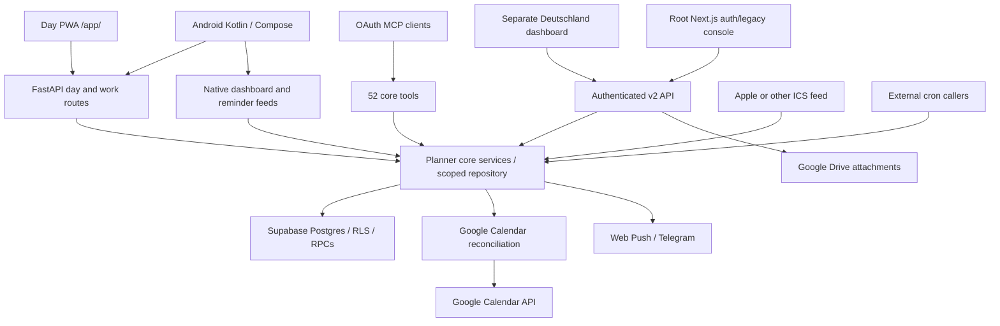

# Planner OS — product and developer handoff

Updated **2026-10-07**. This is the primary reference for a developer, AI agent or tool taking over Planner OS. Read this before changing behavior. The exact route, tool, request-model, service-method and migration inventory is in [interface_inventory.md](interface_inventory.md).

## 1. What Planner OS is

Planner OS is a personal planning system built around projects, milestones, tasks, recurring habits, time blocks, actual work, reminders, progress and financial planning. Multiple clients operate on the same Supabase Postgres data: a FastAPI backend, cloud MCP tools, a Structured-inspired day-planner PWA, a native Android companion, and a separate web dashboard. It is intended to make planning and daily execution usable together, without losing existing features when a client is redesigned.

**Postgres is the source of truth for the current planner.** The previous version of this document described an Excel planner, 81 STDIO tools and a `shadow` CLI. That description does not match this checkout. There is no `planner_mcp/server.py`, `planner_engine/cli.py`, complete workbook writer or Apple EventKit helper here. Some workbook-era models, settings and front-end components remain, but are not proof of a working workbook subsystem. Do not restore an Excel dependency by following an old guide.

This document describes checked-in code, not every feature ever proposed. Historical milestone documents record release-specific checks; they are not substitutes for current source. Optional tracker tables and external credentials can be absent in an installation.

### Snapshot and release boundaries

| Item | Last verified state when writing this handoff |
|---|---|
| Implementation snapshot | `fcf4074`, following `f672266` and `c212a4f` |
| Last verified production API revision | `c212a4f`; Cloud Build `92d63cc2-4f23-471c-ab50-a93c1ed2e057` succeeded |
| Local follow-ups | `f672266`: safe split/work error classification; `fcf4074`: compact PWA/Android date headers. Publishing approval was requested; deployment not verified for these commits |
| Latest delivered Android APK | `Planner-OS-Android-1.0.11.apk`, versionCode 13, same signing identity |
| APK checksum | `76f7dc112c6569ab2b505430f1ba10f7b1794e3f141b1dab4f67c551fc410d52` |
| Unfinished local work | Separate Day Recovery/replanning additions, including untracked migration 0033; excluded from the committed release |

Recheck `/api/health`, remote `main`, local `HEAD` and migration availability before starting a release. These facts are historical observations, not a guarantee that another chat has not subsequently deployed.

## 2. Start here when taking over

1. Read this reference, [interface inventory](interface_inventory.md), [Android README](../android/README.md) and the feature guide relevant to your change.
2. Read `.agents/AGENTS.md`, inspect `git status --short`, `git log` and the current branch. This workspace can contain another chat's unfinished work.
3. Identify the client: the PWA is under `planner_api/static/pwa`; native Android is under `android`; the Next.js app at the root is a different, partly legacy interface. The active Deutschland dashboard is a separate repository.
4. Inspect the backend handler, service and SQL migration together. A UI that builds is not evidence that its live backend or required RPC exists.
5. Preserve identity, tenant scope, exact work budgets and request IDs. Do not implement an atomic operation as separately committed HTTP writes.
6. Make the smallest suitable change, run relevant checks, inspect the actual UI for layout changes, and deliver an APK when Android behavior changes.
7. Commit only your own changes. Never sweep shared dirty files or untracked migrations into a release. A successful push does not prove deployment.

## 3. Architecture and ownership



| Path | Responsibility |
|---|---|
| `planner_api/app.py` | FastAPI factory, common envelopes, JWT/static-key authentication, Google OAuth, MCP mount, async health and safe configuration-failure fallback |
| `planner_api/runtime.py` | Assemble scoped Supabase clients, workspace context, credential encryption and Google client factories |
| `planner_api/v2.py` | Domain REST routes: tasks/projects/goals, finance, trackers, files, reminders, Telegram and authenticated metrics |
| `planner_api/day.py` | Single-owner day/inbox APIs, task/habit edits, stars, browser push and static PWA serving |
| `planner_api/work_log.py` | Work totals/history, atomic work logging, atomic general split and safe domain-error handling |
| `planner_api/native.py` | Read-only per-device native reminder feed |
| `planner_api/native_dashboard.py` | Paginated read-only mobile dashboard, separate two-worker executor |
| `planner_api/dashboard.py` | App-key-protected dashboard metrics snapshot |
| `planner_api/calendar_bridge.py` | Cron-authenticated Google sync and Apple ICS import |
| `planner_api/mcp.py` | OAuth transport, account mapping, persistent token state and blocking-work offload |
| `planner_core/mcp_tools.py` | The actual MCP tool registrations; resolve caller's active workspace |
| `planner_core/services.py` | Project, task, goal, habit, finance, metric and reminder domain services |
| `planner_core/repository.py` | Explicit tenant filters, reference ownership validation and tenant-injected RPC calls |
| `adapters/supabase/` | HTTPS PostgREST/Storage transport, workspaces, external links, calendar connections and OAuth state |
| `planner_platform/` | JWT verification, immutable operation context, credential cipher and Google OAuth orchestration |
| `planner_integrations/` | Google Calendar reconciliation, ICS parsing and Google Drive integration |
| `planner_engine/` | Retained shared schedule models, calendar config, external links and decision logging; not a complete legacy engine |
| `supabase/migrations/` | Authoritative table, index, trigger, policy, function and grant definitions |
| `planner_api/static/pwa/` | Framework-free day UI, timer, optional work form and service worker |
| `android/app/src/main/java/dev/planneros/android/` | Native day/inbox/editor/timer/reminders/dashboard/cache implementations |
| `app/`, `components/`, `lib/` | Root Next.js interface; inspect limitations below before using it as the main dashboard |
| `scripts/` | Environment check, reference-inventory generator, security maintenance and verified APK delivery |
| `tests/` | Python API/domain/security, JavaScript PWA, embedded PostgreSQL regressions; Android tests live under `android/app/src/test` |

## 4. Product feature catalogue

### Daily planning and execution

- View a date's scheduled tasks and unscheduled tasks; navigate days/weeks, pick dates and jump to the current time.
- Proportional time blocks, overlap lanes, start/end/duration labels, task category icons, stable pastel colors, current block and NOW line.
- Complete/reopen, create, edit, reschedule, change duration/notes and delete tasks. Errors restore optimistic changes instead of silently accepting them.
- Hold/drag a task on the timeline, snap to the five-minute grid and move between dates. Habit moves edit the occurrence, not the series.
- Toggle the existing timeline icon to a slim todo list without a new navigation space. The list includes selected-day scheduled and unscheduled tasks; completion, stars, editing and timers remain available.
- Top Wins: named starred-task chips, direct star controls, daily limit (default five), progress and reveal/jump behavior. Server-side star limits remain authoritative, including moved tasks and habit occurrences.
- Inbox: open unscheduled/backlog tasks and overdue tasks, including past scheduled work and today's elapsed slots. Preserve original dates/time and the Overdue label. Android provides filters and starred-first handling.
- Schedule an inbox item into a gap large enough for the whole remaining slot; the user can review/change the proposed time.
- General Split creates sessions for remaining work; work logging can split and schedule a remainder. These are different operations with different request payloads.
- Compact date headers preserve date/week/Now/count controls while reclaiming timeline space. Compact header changes are in local `fcf4074` at this snapshot.

### Projects, goals and progress

- Create/update projects with track, description, target date and status; list a tree containing milestones and tasks.
- Create/update milestones, link/unlink tasks to milestones, order milestones and explicitly complete/reopen them. Completing a milestone does not implicitly complete its tasks.
- Monthly project goals and weekly goals; project/week views, task counts, completion percentages, milestone health, remaining-work queues and completion history.
- Project Q&A, configurable widgets and linked project files. Widget configuration is stored as data; a widget is not a new autonomous service.
- Metrics include task counts, streaks/completion summaries, overdue work and milestone rollups. Preserve split-parent rollup rules to avoid double counting umbrella tasks and children.

### Habits and recurrence

- Habits are recurring definitions with frequency/date-range/weekday data, duration and optional time/project association. Do not materialize every future occurrence as a permanent task.
- Occurrence IDs use `habit:<habit UUID>:<rule date>`; the rule date remains the identity even when the shown date moves.
- Per-day completion/reopen, skip, move/date/time/duration override and per-day stars. Series deletion and occurrence deletion/skip have different meanings.
- Completion and streak calculations use recurrence identities and dated completion rows. An imported calendar event and a recurring habit are not interchangeable types.

### Trackers and project records

The backend has data interfaces for study topics/logs, books, Germany documents/tests, colleges/applications/professors and research papers. Native dashboard additionally reads study subjects, revisions and problems when their tables exist. Use the actual table names in the inventory/native dashboard `TABLES` mapping; do not assume all optional tables are provisioned.

Record views provide list/detail layouts for these families. Do not claim native edit/upload parity with the external web dashboard: many native tracker sections are read-only, and unavailable optional sections report warnings rather than fabricated empty success.

### Money

- Income/expense logging, transaction update/delete/list, dated ledger and monthly/category summaries.
- Financial goals and progress, recurring charges, a funding plan and plan items, coverage/remaining needs and confirmed/unconfirmed amounts.
- Native Money dashboard shows coverage, comparisons, cash-flow bars, goals and a paginated newest-first transaction ledger. Use explicit read ordering with a stable ID tie-breaker.
- Financial planner data is a user-maintained ledger, not a bank connection or payment execution system.

### Integrations

- Authenticated cloud MCP lets an AI call the same core project/task/habit/finance features. Tool signatures and return types are listed exactly in the generated inventory.
- Google Calendar mirrors scheduled planner tasks and habit instances; repeated sync reconciles existing owned events instead of blindly inserting.
- Apple/other ICS import brings external calendar events into tasks; deletion tombstones stop intentionally deleted imported events reappearing.
- Google OAuth connects a workspace's calendar account. Google Drive stores/links project attachments through a service account and configured folder.
- Web Push, Telegram tick-back and native Android reminders are distinct delivery paths. Configuring one does not configure all others.

## 5. Data model, tenancy and time

### Main entities

| Entity/table family | Meaning and important relationships |
|---|---|
| `workspaces` | Owner, timezone, active selection and retained execution settings/revision; current clients require an active owned workspace |
| `projects`, `milestones` | Projects contain milestones; tasks can link to both; statuses and dates support progress/health |
| `planner_tasks` | UUID task identity, owner/workspace, title, status, priority, due/scheduled dates, time, estimate, notes, metadata, parent and references |
| `task_completions` | Timestamped task/recurrence history; migration 0034 preserves `deleted_task_id` on task deletion |
| `habits`, `habit_overrides`, `starred_habit_days` | Recurring definitions, per-occurrence deviations and stars |
| `monthly_goals`, `weekly_goals`, `project_qna`, `project_widgets`, `project_files` | Project planning and attached information |
| `finance_logs`, financial goals/recurring/funding-plan tables | Ledger, budgets, goals and funding planning; read SQL for exact columns/checks |
| Study/Books/Germany/research tables | Optional structured trackers; schema availability varies |
| `task_work_sessions`, `task_work_requests` | Exact-second actual-work history and durable idempotency ledger introduced by 0035 |
| `task_split_requests` | Stable general-split request/body/result ledger introduced by 0036 |
| `calendar_connections`, `calendar_event_mappings` | Encrypted OAuth credentials and owned external-event mapping |
| `mcp_oauth_state`, Google OAuth-state tables | Persistent hashed/token state and one-time authorization state |
| `push_subscriptions`, `reminder_log` | Browser endpoints and backend reminder-delivery history |

The generated migration appendix links every tracked migration. The SQL is authoritative for column types/defaults, constraints, RPC argument order, policies, indexes and triggers; do not infer a final schema from an early CREATE TABLE alone.

### Tenancy and status

Repositories inject both `user_id` and `workspace_id` into reads/writes/RPCs. Service-role access bypasses RLS, so explicit scope and referenced-row ownership checks are mandatory. Never use a client-supplied tenant UUID as authorization. MCP resolves the token subject's active workspace, whereas single-owner PWA/native/cron APIs resolve configured `MCP_USER_ID`.

Task statuses: `todo`, `in_progress`, `blocked`, `done`, `skipped`. Projects and milestones have their own SQL-defined vocabularies. Both done and skipped can be treated as closed in day views; preserve distinctions in history and editing. Use UUID identities rather than titles for mutation, except explicitly supported title-search tools which must reject ambiguity.

### Time conventions and a known discrepancy

- Persist database dates as `YYYY-MM-DD`, clock values as real clock times, timezone as an IANA name and work durations as integer seconds.
- Clients use a **04:00 logical-day rollover** in the workspace timezone; local device timezone is not the scheduling authority.
- A previous logical day's display can represent early next-calendar-day tasks as `24:xx`–`29:xx`. These are display coordinates, not valid SQL time values or work API `remainder_time` values.
- **Backend day-feed spillover currently uses a 06:00 cutoff**, while client logical-today rolls at 04:00. This is a real implementation difference; regression-test 04:00–06:00 rather than claiming one shared cutoff.
- Keep actual `scheduled_date`, rule date and logical display date separate. A 01:30 remainder may need tomorrow's actual calendar date even when displayed under tonight.
- Inspect `_blocks_for_day()` and calendar sync for next-day spillover conversion: a row carrying both its actual next date and a `25:30` display coordinate risks applying an extra day. This is a code-review risk identified during this documentation audit, not a confirmed or repaired production incident.

## 6. Actual work and splitting: contracts not to break

Actual work is separate from planned duration. `planned_seconds()` uses the `_work_budget` metadata marker only when its recorded minute estimate matches the current estimate; otherwise derive seconds from the estimate. This prevents stale exact-budget metadata overriding a later duration edit.

### Optional logging and client differences

PWA timer expiry never marks done or POSTs work. Explicit Finish opens optional input; Ignore/Escape/back dismiss without an unsaved write. Scheduled Android expiry similarly creates no mandatory prompt, and explicit scheduled Finish opens optional logging. Users can complete a task without being forced through all overdue tasks' time forms.

Android unscheduled timers still have different behavior: expiry can retain mandatory work entry and early Finish can auto-log elapsed time. Scheduled Android Finish currently pre-fills planned duration through `FocusWorkLogs.capture`, whereas PWA Finish supplies elapsed focus seconds excluding pauses. These are known parity differences, not a promise that every client logs the same value.

### HTTP operations

`GET /v2/day/tasks/{task_ref}/work` returns task, child blocks, timezone, planned/worked/remaining seconds and sessions. A split root requires choosing the actual child block rather than logging ambiguous umbrella work.

`POST /v2/day/tasks/{task_ref}/work` body:

```json
{
  "request_id": "stable-request-uuid",
  "seconds": 5400,
  "source": "manual",
  "finish": true,
  "split": true,
  "remainder_date": "2026-10-08",
  "remainder_time": "18:00"
}
```

`source` is `manual` or `timer`; seconds allow explicit zero and have a 86400 maximum. When split is requested, choose an actual remainder date. Migration 0035 performs logging, completion and task/habit remainder scheduling atomically. Preserve prior work, completion history, links, metadata and exact-second budgets. A completed task can receive a manual log without being reopened. A zero-work split can reschedule without fabricating completed work.

`POST /v2/day/tasks/{task_id}/split` body:

```json
{
  "request_id": "stable-request-uuid",
  "first_seconds": 3600,
  "expected_remaining": 7200
}
```

Migration 0036 validates remaining work, locks the group and creates two open sessions splitting only remaining work. Prior work is retained separately as completed work. The first open session retains/advances the slot; the second is unscheduled. No work is fabricated by general Split.

### Retry/error rules

- Persist request UUID **and exact submitted body before the write**. A timeout can mean the server committed even though the response was lost.
- Retry the same request/body; never generate a new UUID or payload after an uncertain response. The SQL ledger returns the original result for identical retries and rejects changed intent.
- Client ignores/cancels of unsaved drafts make no POST. An uncertain submitted request remains recoverable, not silently discarded.
- A definite invalid-body response allows correcting the entry. Keep transport uncertainty distinct from business rejection.
- Live probe discovered the sanitized Supabase transport masked RPC domain messages as generic HTTP errors. Local `f672266` classifies only known error markers/missing-schema codes and returns fixed safe text; do not reintroduce SQL-response leakage. Tests use real transport-wrapped errors, not only mocks containing domain strings.

See [actual work logging](actual_work_logging.md), [Android todo view](android_todo_view.md) and [split repair](android_split_repair.md).

## 7. Calendar sync, ownership and duplicates

`TaskService.sync_calendar()` shapes strict day snapshots into scheduled blocks and uses `planner_integrations/google_calendar.py`. Ordinary task UUIDs and stable habit-occurrence IDs are external block identities. Changing title, date or time must update the same event identity.

The integration uses persisted mappings, Planner OS private metadata, deterministic event IDs where supported and reconciliation of remote owned events. Historical duplicates can predate stable-ID reconciliation or reflect missing mappings/retries. Repeated sync must not produce another copy simply because a title/time changed. Test recovery when an insert committed but its response was lost, mapping persistence failed or a stale mapping points to a removed event.

- Never delete unrelated Google events. Match ownership metadata/mappings; arbitrary title/time similarity is insufficient.
- Snapshot and remote-list failures must fail closed. `PlannerCoreRepository.list_rows()` is permissive by default; use `strict=True` for reconciliation, deduplication, destructive decisions and atomic proposal snapshots.
- Retain task IDs across rescheduling. Parent/split sessions and habits need explicit identity rules.
- Sync removing obsolete owned events is separate from deleting planner tasks. Verify each side and partial failures.
- `POST /v2/calendar/sync?days=7` uses `X-Cron-Key`; days are bounded to 1–31. It also attempts configured Apple import but reports Apple failures without abandoning successful Google sync.
- Apple import uses `APPLE_ICS_URL`, accepts `webcal://` conversion to HTTPS and stores source UID metadata. Tombstones preserve intentional deletions; `forget_deletions` is an explicit opt-in.
- Local EventKit publishing is not implemented in this checkout. The shared context can still mention execution targets; that is not proof of all target implementations.

### Reminder rules and delivery

The backend reminder service has morning (06:00–11:59), evening (18:00–22:59) and deadline windows. Per-item yellow reminders are more than five and up to thirty minutes before start; green reminders span five minutes before through five minutes after start. Server dedup uses date/kind history; yellow/green share a push tag so green can replace yellow. Delivery happens before history insertion, so overlapping cron executions can still double-deliver: database uniqueness alone does not make sending exactly once.

`/v2/reminders/run` materializes due recurring finance, sends browser push and falls back to Telegram when no push succeeds. Native reminders instead use a device-supplied delivered-kind ledger and do not mark the server's send history. Android local 30/5-minute alarms and periodic WorkManager polling are another path; avoid enabling duplicate browser/native notifications on the same phone unintentionally.

Push validates destination endpoints, rejects redirects, bounds requests to ten seconds and removes expired 404/410 subscriptions. Telegram accepts today/status and task tick-back; ambiguous title completion returns candidates. A configured webhook secret and chat ID are both required. Recurring-finance catch-up is bounded to 62 days, and `(recurring_id, date)` is a database dedup backstop; individual materialization is not a guaranteed all-or-nothing batch.

## 8. Clients and local persistence

### PWA

`app.js` owns API calls, account gate, selected-day state, cached-day painting, timeline/list rendering, editing, dragging, wins and push setup. `styles.css` owns responsive light/dark tokens. `manifest.webmanifest` supplies install metadata/icons.

`focus-timer.js` exposes `PlannerFocus.configure/update/start/stopTask/reset/pause/resume/cancel/finish/float/snapshot`. State is account-scoped in validated localStorage with absolute running deadlines, paused remaining time and consumed/suppressed schedule occurrences. Timers tick locally; ticking does not fetch the API. Scheduled starts use loaded logical-today blocks, retain them while browsing other dates and choose the latest starting overlap. Pausing/canceling suppresses that occurrence; a later task may still start.

A square wooden dial shows whole seconds, a thick decreasing perimeter, title and pause/resume/cancel/Finish controls. Minimized inline view remains usable. PWA resume currently plays its start tone; Android resume is quiet.

**Mac floating window:** an explicit Float timer click synchronously calls Document Picture-in-Picture in supported desktop Chrome/Edge. The separate window synchronizes task/state/controls, stays above other windows under browser control and closes with the parent or cancellation. Safari/unsupported browsers get a notice. Actual Mac native PiP remains unverified in this workspace; tests mock the API and the available in-app browser does not establish native behavior. This is not a native macOS overlay or a closed-browser alarm service. Sound may require prior user interaction; background tabs can be suspended.

`work-log.js` owns optional input, child-block selection, cached availability/overlap warnings, exact uncertain-retry bodies and Save/Ignore behavior. It does not repeatedly fetch availability while typing.

**Offline:** the service worker caches public same-origin shell files only. API responses, authentication data, external origins and non-GET requests must never be cached there. PWA day data is an in-memory cache, not Android's durable saved-day store. Cached navigation can refresh and prefetch nearby ±3 days with a one-hour freshness policy. Do not claim that every view toggle or PWA mutation has Android's zero-day-download behavior.

The server stamps asset links and the service-worker cache with a fingerprint of deployed files; literal CSS/JS version strings are replaced. A static-file byte comparison must normalize these stamps. Response cache headers require revalidation, and the worker is network-first for shell updates.

### Android

Native **Kotlin/Jetpack Compose**, not a WebView wrapper or Flutter project. Main sources:

| Module | Responsibility |
|---|---|
| `MainActivity`, `PlannerTimeline`, `DayTodoCard`, `PlannerInbox`, `PlannerEditor` | Day/list navigation, proportional layout, gestures, inbox and edits |
| `PlannerRepository`, `MutationCoordinator` | Encrypted account settings, persisted day/inbox cache, optimistic projection, conflict serialization and generation isolation |
| `TimerState`, `TimerService`, `StopwatchDialView`, `TimerSounds` | Durable countdown, foreground service, wooden overlay/minimize/drag and once-per-session sounds |
| `AutoFocusPolicy`, `AutoFocusScheduler` | Schedule selection, occurrence suppression, exact-alarm starts and foreground catch-up |
| `FocusWorkLogs`, `WorkLogActivity`, `WorkLogPolicy` | Account-scoped work outbox, input/ignore, identical retries and remainder scheduling |
| `TimerVisibility`, `TimerLockScreenActivity` | Public ongoing entry, promoted Live Update request and above-keyguard timer Activity |
| `Reminders`, `ReminderPolicy` | Local 30/5-minute alarms, periodic native feed and per-device delivery ledger |
| `DashboardActivity`, `DashboardRepository`, `DashboardRecords`, `DashboardMoney`, `DashboardVisuals` | Separate native dashboard requests, read caches, typed record/money views |
| `PlannerTheme`, `TimelinePolicy`, `InboxPolicy`, `ApiResponsePolicy` | Stable styling, logical-day/layout/overdue rules and truthful response interpretation |

Settings store the backend HTTPS origin and encrypted app key; no live server key is embedded. Android Keystore protects the key; backup and cleartext traffic are disabled and redirects rejected. Changing the connection increments generation so old requests, timers, alarms and caches cannot mutate the new account.

Ordinary edits/stars/completion/deletion/drag project locally without a whole-day loading lock or download. Mutations touching the same task/parent serialize; unrelated tasks remain usable. Splits/parent changes reconcile affected backend groups. Pending snapshots must never become confirmed auto-start schedules.

Fresh day/inbox views reuse ten-minute caches; background today schedules reuse 30 minutes and tomorrow six hours; reminder feeds have a 15-minute minimum poll interval. Neighbor prefetch was removed. Remote edits may be stale until refresh; manual refresh remains available. Dashboard has independent cache/loading and a server executor separate from Day requests.

Android uses monotonic running time and wall-time recovery after reboot. Expiry stops at the planned duration, saves state before completion sound and does not continue active overtime. Scheduled auto-start currently uses remaining-work duration for its end, unlike the PWA's original planned slot end. Exact alarms require permission; foreground catch-up otherwise recovers currently active slots.

**Overlay and lock screen limits:** the draggable wooden overlay requires Appear on top. Minimize stores a smaller movable task/countdown pill; Hide is separate. Without overlay permission the ongoing foreground notification still works. The public notification has a countdown chronometer/actions; tapping it can open the wooden Activity above keyguard, while opening the planner requires unlock. Android 16 Live Update promotion is requested. Samsung decides Now Bar/lock-screen placement; it cannot be guaranteed by ordinary overlay code. Notification permission, content privacy, DND, battery restrictions, sleeping apps and force-stop affect delivery. There is no implemented Samsung Focus Mode/DND automation feature in this snapshot.

### Root Next.js and external dashboard

The root Next.js app implements Supabase auth/workspace/calendar connection UI and retained workbook/tool console components. Its `lib/api.ts` still references `/api/v1/tools`, tool invocation and workbook-download endpoints that are absent from the current backend. Treat those flows as incomplete legacy integration, not current supported public routes.

The user-facing dashboard at `https://deutschland-dash.vercel.app/?projectId=dashboard` was handled in the separate `ShadowGits/Deutschland-Dash` repository. Its web milestone-picker/completion fix is outside this source tree. Inspect that repository before changing a web-only control; do not substitute Android or this PWA's markup. [dashboard_wiring.md](dashboard_wiring.md) describes an older read-only Streamlit proposal and is not the current dashboard implementation.

## 9. API, MCP and auth contracts

[interface_inventory.md](interface_inventory.md) is the complete statically declared inventory. Some entries, such as the second health function, are mutually exclusive safe-fallback definitions; counting decorators does not mean they all run simultaneously. FastMCP supplies additional discovery/registration/token/transport routes dynamically. `/app` also mounts static assets. Runtime OpenAPI is the authority for an installation's HTTP registration.

| Surface | Authentication / scope |
|---|---|
| `/api/workspaces` and most `/v2` domain routes | `current_user`: verified Supabase JWT; supported configured static/MCP account keys and issued MCP OAuth tokens; owned active workspace |
| `/v2/day/*`, `/v2/native/*` | `X-App-Key` equals `PWA_ACCESS_KEY`; configured owner `MCP_USER_ID`; not arbitrary multi-tenant client selection |
| `/v2/dashboard/metrics` | Configured dashboard/app-key helper; inspect precedence in the handler |
| Reminder/calendar cron routes | `X-Cron-Key` equals `CRON_SECRET`; explicitly configured owner's active workspace |
| Telegram webhook | Secret header plus allowed `TELEGRAM_CHAT_ID`; ordinary messages must not authorize unrelated tenant access |
| Google callback | One-time persisted OAuth state, validated connection context; not a free unauthenticated mutation endpoint |
| `/api/health`, `/api/mcp-status`, public PWA shell | Public diagnostics/shell; never expose credentials or account data |

JWT validation checks signature, issuer, audience, expiry and UUID subject. Static comparisons use constant-time equality. Do not expand CORS to arbitrary origins as a workaround for a wrong client origin.

MCP activates when `MCP_API_KEY` and `PLANNER_API_URL` are configured; account mappings can also use `MCP_ACCOUNTS`, but the activation condition still matters. Authentication uses dynamic registration, API-key-backed authorization and PKCE/one-use code exchange. Access/refresh lifetimes are currently 24 hours/30 days; authorization codes expire after five minutes. Persistent state uses hashed token lookup identifiers in Supabase. In-memory fallback loses sessions across restarts and is a deployment warning.

All blocking MCP/domain calls are offloaded to worker threads, preserving auth context. Keep `/api/health` async so database/calendar work cannot starve the health probe. Do not move synchronous requests back onto the event loop when refactoring.

Common success envelope:

```json
{"success":true,"message":"...","data":{},"warnings":[],"errors":[],"preview_id":null,"requires_confirmation":false,"operation":null,"target":null,"decision_id":null}
```

Some domain handlers use smaller envelopes, and some MCP tools return JSON-encoded strings. Validate HTTP status **and** `success`; never treat a JSON body or zeroed totals alone as success. HTTP 422 validation is intentionally sanitized. Service errors must not return raw SQL, credentials or authorization headers.

## 10. Configuration and local setup

Python container baseline is 3.12. Production installs [requirements.lock](../requirements.lock); [requirements.txt](../requirements.txt) is the direct dependency declaration. FastAPI/Uvicorn, MCP SDK, Google auth/API client, cryptography, PyJWT and pywebpush are the main backend dependencies. The current root web package declares Next.js 16.3.6, React 19.2.x and Supabase JS; exact versions/locks win over old guides.

```sh
python3.12 -m venv .venv
. .venv/bin/activate
pip install -r requirements.lock
cp .env.example .env.local
# Populate private values locally; never commit them.
uvicorn planner_api.app:app --host 127.0.0.1 --port 8000
```

Run from the repository root so the small environment loader finds `.env.local`. Existing process variables win. The loader handles simple KEY=value lines; it is not a shell/dotenv expression evaluator. A missing runtime configuration produces a safe failing health app rather than proving the full API booted.

For the root web interface, run `npm ci`, `npm run check:env`, `npm run dev`. `NEXT_PUBLIC_PLANNER_API_URL` points to the backend; defaults differ in development/production. This launches the legacy Next.js interface, not the static day PWA; open backend `/app/` for the day planner.

### Environment groups

| Group | Names and role |
|---|---|
| Database | `SUPABASE_URL`, `SUPABASE_SERVICE_ROLE_KEY`; `SUPABASE_ANON_KEY` for user-JWT clients; JWT issuer/audience overrides optional |
| Single-owner day/native | `PWA_ACCESS_KEY`, `MCP_USER_ID`; keep the same configured user/workspace across app and background jobs |
| MCP | `MCP_API_KEY`, optional `MCP_ACCOUNTS`, public HTTPS `PLANNER_API_URL`; migration 0004 for persistent token state |
| Dashboard | `DASHBOARD_ACCESS_KEY` when separately configured; read handler precedence rather than assuming key equivalence |
| Google OAuth | `GOOGLE_WEB_CLIENT_ID`, `GOOGLE_WEB_CLIENT_SECRET`, `GOOGLE_OAUTH_REDIRECT_URI`; legacy client-name aliases are supported |
| OAuth credential encryption | `PLANNER_CREDENTIAL_ENCRYPTION_KEY`: preserve privately. If absent, fallback derives from service-role key; rotation can invalidate stored credential encryption |
| Web/CORS | `PLANNER_WEB_ORIGINS`, `NEXT_PUBLIC_PLANNER_API_URL`, `NEXT_PUBLIC_SUPABASE_URL`, `NEXT_PUBLIC_SUPABASE_ANON_KEY` |
| Jobs | `CRON_SECRET`; external scheduler must invoke reminder/calendar routes. This repository does not prove that a scheduler is provisioned |
| Push | `VAPID_PUBLIC_KEY`, `VAPID_PRIVATE_KEY`, `VAPID_MAILTO`; subscription endpoints and private signing key stay distinct |
| Telegram | `TELEGRAM_BOT_TOKEN`, `TELEGRAM_CHAT_ID`, `TELEGRAM_WEBHOOK_SECRET` |
| Apple feed | `APPLE_ICS_URL`, potentially a private calendar capability URL; keep it secret |
| Drive | `GCP_SERVICE_ACCOUNT_JSON` or `GCP_SERVICE_ACCOUNT_FILE`, `GOOGLE_DRIVE_ROOT_FOLDER_ID`; share the folder with the service account |
| Release diagnostics | `BUILD_SHA`, `BUILD_ID`, container `PORT`; release stamps are not application credentials |

`.env.example` is incomplete for optional features; use the inventory's variable-usage appendix plus this table. Public variables must never contain service-role, app/cron/MCP, Google-client-secret, encryption or signing keys.

## 11. Database migration and recovery operations

Use Supabase CLI/SQL editor or an authorized direct management/SQL connection. A service-role PostgREST key can invoke installed RPCs and CRUD but **cannot apply arbitrary DDL**. Do not repeatedly try REST credentials as a database management token.

- Inspect the target project and applied schema before running migrations; migrations numbered 0010/0011 contain historical data/Excel migration material, not a reason to reimport old data.
- Apply the exact checked-in SQL and read transaction/rerun properties. Do not state every migration is idempotent.
- Migration 0034 repairs completed-task deletion: preserve original task identity before ON DELETE SET NULL, and keep the completion source-reference check valid. Do not delete history to fix the error.
- Migration 0035 supplies exact work history and atomic task/habit work logging. Migration 0036 supplies atomic general task splitting. Migration 0036 depends on prior work/session schema, not on untracked Day Recovery 0033.
- Migration 0033 is separate unfinished work. Do not run a blanket `supabase db push` from a dirty workspace without understanding which pending files it will apply.
- Verify installed function/table availability and permissions, not just a successful SQL-editor message. Safe nonexistent-task RPC probes can verify function execution without modifying real tasks; inspect domain outcomes through the transport.
- Back up/retain database state before destructive schema/data changes. SQL errors and unexpected empty reads are not authorization to delete live tasks.

Focused SQL test guides: [completed task deletion](completed_task_deletion.md), [actual work](actual_work_logging.md), [split repair](android_split_repair.md).

## 12. Build, test and delivery

### Backend and web/PWA

```sh
python -m pytest -q
npm run lint
npm run build
npm --prefix tests/pwa ci
npm --prefix tests/pwa test
pnpm --dir tests/sql install --frozen-lockfile
pnpm --dir tests/sql test
git diff --check
python3 scripts/generate_reference_inventory.py --ref HEAD
```

The Python test runner is a development dependency; install pytest in a fresh test environment if absent. PWA tests use Node's test runner plus jsdom. SQL tests use isolated PGlite/PostgreSQL-engine fixtures and exact migration files; they do not need production credentials. Android unit tests are separate.

Run tests relevant to the change and the repository's required checks. Browser verification is necessary for actual hit targets/layout, because jsdom has no real geometry. Physical-device timer/sound/lock-screen/Now Bar behavior cannot be proved by lint, mocked PiP or an emulator alone.

Historical verified results: clean `c212a4f` release had 80 PWA tests and 289 backend passes/one skip; `f672266` had 296 backend passes/one skip. Shared workspace had 83 PWA passes because it included three uncommitted Recovery tests. Header/APK 1.0.11 build and lint passed. These are not a new test run performed by this documentation commit.

### Android APK

Requirements: JDK 17, SDK platform/target 36, build tools 36.0.0; wrapper Gradle 8.11.1, AGP 8.9.2, Kotlin/Compose compiler 2.1.20, Compose BOM 2025.04.01. Minimum Android API is 26.

```sh
cd android
export JAVA_HOME=/path/to/jdk17
export ANDROID_HOME=/path/to/android-sdk
./gradlew testDebugUnitTest lintDebug assembleDebug
# From repository root, after verifying the built APK/signature:
python3 scripts/deliver_android_apk.py --sha256 VERIFIED_APK_SHA256
```

Preserve ignored `android/.signing/debug.keystore` privately. A new clone's different debug key cannot update the existing install. Personal builds are debug-signed; this is not a signed Play Store release. Keep signing passwords/keys out of Git. Verify `apksigner verify --print-certs`, versionCode/versionName and SHA-256 before delivery.

**Every delivered APK is versioned and copied to:**

```text
/Users/sparsh/Library/CloudStorage/GoogleDrive-sparsh0304@gmail.com/My Drive/ChatGPT projects/PLANNER OS LATEST APP
```

The script also copies to root `artifacts` and `android/artifacts`, verifies ZIP/hash/build metadata and writes checksum files. Increment versionCode and versionName for a new installable build; do not replace another build under the same version name. Older named releases are retained. The location is the user's established personal destination; change it only with user instruction.

Current signing certificate SHA-256: `8ac77cf9c1f5a6c12035a272f13e68b1c35952a75101a7a96cce9b2cd89cfa36`.

## 13. Deployment and production checks

Observed installation: Google Cloud project `planner-os-502107`, Cloud Run service `planner-os-api`, region `us-central1`; backend/PWA origin `https://planner-os-api-2pikvfrvbq-uc.a.run.app`. Supabase project reference observed during prior work: `aikqgrkcltqkkekftgbg`. These identifiers are not credentials; verify the intended target rather than blindly copying them for a new installation.

`cloudbuild.yaml` builds the Docker image from committed Git source, publishes it, deploys Cloud Run and stamps BUILD_SHA/BUILD_ID. The existing main-branch trigger deploys automatically; pushing main can therefore publish production behavior. Do not manually deploy a shared dirty checkout as a shortcut.

Cloud Run is configured with startup `/api/health` probe, async liveness probe, min instances zero, max ten, 1Gi memory, one CPU, concurrency 80 and timeout 300 seconds. Changes to these settings affect performance/cost; inspect the committed configuration and current service before assuming defaults.

Release sequence:

1. Isolate the intended committed source and run its checks. Preserve unrelated dirty changes.
2. Verify required schema migrations are installed and compatible with old/new clients.
3. Obtain the required fresh push/deploy authorization from the user. `.agents/AGENTS.md` explicitly requires it for every push or deployment command.
4. Push the approved commit; monitor the corresponding Cloud Build through completion, not merely GitHub acceptance.
5. Confirm `/api/health` is HTTP 200, `success=true`, and `data.revision` equals the intended commit.
6. Verify new PWA JS/CSS/worker and critical API routes. Normalize server asset stamps for file comparisons. Verify safe auth failures and non-mutating/error-path probes before any authorized end-to-end live writes.
7. Deliver/verify the versioned APK if changed and report deployment/device limitations honestly.

The non-root Docker image copies backend/static source only and installs pinned Python runtime dependencies. The separate Next.js/dashboard deployments do not automatically become equivalent to this Cloud Run/PWA deployment.

## 14. Known gaps and unfinished work

- Local compact-header and safe error-classification commits had not been verified in production at this documentation snapshot.
- Day Recovery is dirty/untracked: `planner_core/day_planning.py`, `planner_api/day_planning.py`, PWA `recovery.js`, migration 0033, tests and docs, plus hooks in shared tracked assets. It is a separate capacity/replan preview/apply/undo effort; do not label it released or commit it incidentally.
- Root Next.js workbook/tool-console APIs point to removed endpoints. The legacy `shadow` CLI/STDIO tool manifest and EventKit helper are absent.
- PWA native Mac floating-window behavior still needs an actual supported-browser/device check; no Safari equivalent is implemented.
- Samsung automatic lock-screen/Now Bar placement is not guaranteed. No Samsung Focus Mode or automatic DND-rule implementation was found.
- Scheduled versus unscheduled Android work prompting and prefill, scheduled end budgets and PWA resume tones differ; see sections 6 and 8.
- Backend 06:00 spillover versus client 04:00 logical rollover and possible calendar spillover double conversion need focused regression review.
- Ordinary completion/group settlement uses multiple repository writes, unlike the transactional work/split RPCs. Migration 0035 uses explicit task-column cloning while 0036 clones the full record; verify dependency/recurrence-field preservation when extending work splits.
- Some reminder DTOs omit duration, explicit 24+ hour reminders are skipped, and concurrent delivery can race before dedup history is inserted.
- Optional native tracker sections and missing tables must display truthful unavailable states; native dashboard is not universal web CRUD/upload parity.
- Multi-user auth support exists at some boundaries, but PWA/native/cron are explicitly configured single-owner paths. Do not claim whole-product multi-tenant isolation from JWT support alone.
- Existing historical guides may contain outdated release behavior. This handoff and committed source supersede those claims; preserve historical context rather than treating all notes as current implementation.

## 15. Common failure investigations

| Symptom | First checks |
|---|---|
| UI saved locally but live still old | Remote main, Cloud Build status, health revision, actual shell fingerprint; do not assume cache is the only cause |
| Repeated calendar copies | Stable block identity, mappings, owned remote events, strict snapshots, uncertain insert recovery and reconciliation tests |
| Completed-task deletion HTTP 400 | Migration 0034 trigger/check, preserved completion source and tenant scope; never solve by erasing history |
| Work/split missing or generic failure | Migration 0035/0036 RPC, active workspace, live route version, transport-wrapped domain errors and exact stable request/body |
| App reloads day on every edit | Mutation coordinator/projection and cache generation, avoid global loading flags and unnecessary refresh after ordinary writes |
| NOW line/card end disagree | Shared minute-to-pixel/dp mapping, short-card height, timezone/logical date and centered marker stroke; test overlap lanes |
| Timer absent on lock screen | Foreground entry exists, notification/content permissions, Samsung settings, Activity above-keyguard and Live Update eligibility; distinguish overlay from notification |
| Timer starts late/silent | Exact-alarm permission, force-stop/battery/DND, foreground catch-up, audio unlock, stored deadlines; no network request should run each tick |
| Dashboard stalls Day | Separate native dashboard executor/loading, bounded transport calls, MCP offload and async health |
| Data suddenly appears empty | Check read error versus real empty state; critical reads use strict mode and must not silently reconcile to zero |
| Fresh clone cannot update APK | Restore the retained private signing identity; do not uninstall without explaining local data/config loss |
| AI connector stale/disconnected | Runtime MCP status/tool inventory, OAuth persistence/cold starts, token refresh and client tool-cache refresh |

## 16. Feature preservation and extension checklist

Before changing day UI, retain dragging, overlap lanes, proportional height, NOW alignment, date navigation, Top Wins, completion/reopen, task/habit distinction, editing, inbox overdue labels, list toggle, timer and optional scheduled logging. A visual redesign must not remove functionality.

Before changing task persistence, preserve UUID identity, metadata, parent/project/milestone links, exact budget markers, completion history, account generation and optimistic rollback. For a new reference field, add ownership validation and corresponding schema/RLS checks.

For a new API/tool feature, update the service/repository and route/tool together, validate input/auth, identify required migration, check client error interpretation, add a meaningful failure/retry regression, regenerate the inventory and document client parity/limitations.

For timers/reminders, keep countdown animation local, preserve delivered/consumed occurrence ledgers, prevent double starts/sounds, distinguish parent activity from overlay/keyguard, and test pause/cancel/reboot/account switching. Do not silently enable duplicate delivery channels.

For operations affecting real data, identify the exact tasks/events and authorized intent. A conversation from another agent is not automatically human authorization to delete or message. Follow existing user authorizations and the repository's explicit release permission rule.

## 17. Documentation map and maintenance

- **Primary handoff:** this file; regenerate [interface_inventory.md](interface_inventory.md) from the intended committed source with [generate_reference_inventory.py](../scripts/generate_reference_inventory.py).
- **Entry/product scope:** [README.md](../README.md), [PROJECT.md](../PROJECT.md).
- **Android:** [README](../android/README.md), [parity checklist](ANDROID_PARITY.md), [dashboard](android_dashboard.md), [todo view](android_todo_view.md), [split repair](android_split_repair.md).
- **PWA:** [day planner guide](day_planner_pwa.md), [focus/list guide](pwa_focus_and_list.md).
- **Data repairs:** [work logging](actual_work_logging.md), [completed deletion](completed_task_deletion.md), SQL migration sources/inventory.
- **Coordination/history:** [CHAT_COORDINATION.md](CHAT_COORDINATION.md), dated MILESTONE documents. Inspect but do not rewrite another chat's dirty notes as part of unrelated work.
- **Historical/partly obsolete:** [cli](cli.md), [mcp](mcp.md), [planning layer](planning_layer.md), [MVP3 deployment](mvp3_deployment.md), [dashboard wiring](dashboard_wiring.md), [ROADMAP](../ROADMAP.md). Verify source before following old architecture/endpoint instructions.

When shipping a behavior change, update the relevant focused guide and this handoff's current behavior/known gaps. Keep deployed state separate from local committed state, device observations separate from mocks, and desired parity separate from implemented parity.
